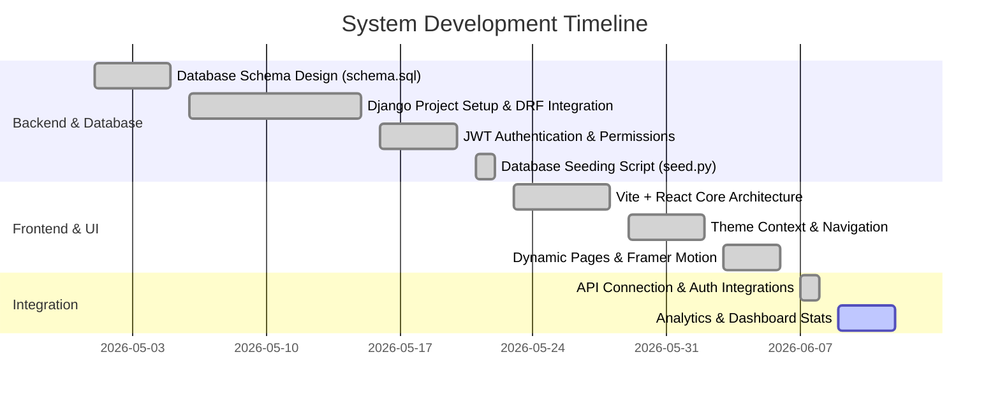

# 🚀 Ahmed Mahamud Ahmed — Portfolio & Research Hub (Garjoox Step)

Welcome to the official repository for the **Ahmed Mahamud Ahmed Portfolio & Research Hub**. This is a state-of-the-art, full-stack application built to showcase engineering projects, academic research publications, technology blogs, and interactive visitor analytics. The system bridges the gap between complex database systems (PostgreSQL/SQLite) and modern, dynamic user interfaces (React + TailwindCSS).

---

## 📅 Project & Career Chronology

Below is a detailed timeline mapping out the system's development lifecycle and the professional journey of the author.

### 🛠️ 1. Technical Development Chronology


| Phase | Milestone | Focus Areas | Key Deliverables |
| :--- | :--- | :--- | :--- |
| **Phase 1** | **Database Schema Design** | Relational mapping, constraints, indexing rules. | `schema.sql` (15 tables optimized with custom indexes) |
| **Phase 2** | **Core Backend Setup** | REST Framework setups, models mapping, and serializer logic. | Django apps (`api`, `core`) with modular architecture |
| **Phase 3** | **Security & Auth** | API permission blocks, SimpleJWT tokens, and security rules. | Admin-only CRUD operations and Token authentication |
| **Phase 4** | **Frontend Core** | State managers, Tailwind CSS tokens, and route protection. | `ThemeContext`, `AuthContext`, Protected Routes |
| **Phase 5** | **Dashboard & Charts** | Visitor logging, data visualization, admin charts. | Analytics logging, Recharts dashboard stats |

### 🎓 2. Professional & Academic Chronology (Ahmed Garjoox)
* **Software Engineering Roots**: Began as a software engineer specializing in frontend applications, UI/UX, and client-side performance.
* **Database Specialization**: Advanced into database administration (DBA) and optimization, specializing in PostgreSQL, MySQL, and SQL Server indexing and distributed layouts.
* **Academic & Scientific Focus**: Expanded into advanced database systems research, horizontal sharding optimization, and quantum consensus protocol modeling.
* **Present Day**: Architecting enterprise-grade full-stack systems and leading custom data engineering solutions.

---

## 💻 Tech Stack & Architecture

### Frontend (User Interface)
* **Framework**: React (Vite-powered for lightning-fast HMR)
* **Styling**: TailwindCSS & Vanilla CSS
* **Animations**: Framer Motion (for smooth micro-interactions)
* **Icons**: Lucide React
* **Charts**: Recharts (for administrative stats visualizer)

### Backend (API Engine)
* **Framework**: Django & Django REST Framework (DRF)
* **Authentication**: DjangoRESTFramework SimpleJWT (JSON Web Tokens)
* **Database Options**: PostgreSQL (Production-ready via `schema.sql`) / SQLite (Local development default)
* **Utilities**: CORS headers, Pillow (Media processing), python-dotenv

---

## 📂 Project Directory Structure

```text
garjoox1/
│
├── backend/                   # Django REST Framework Application
│   ├── api/                   # API application (models, views, serializers, urls)
│   ├── core/                  # Project configuration settings & core urls
│   ├── media/                 # User-uploaded files (profile pictures, research PDFs)
│   ├── manage.py              # Django CLI utility
│   ├── requirements.txt       # Python package dependencies
│   └── seed.py                # Database seeding script (superuser, mock analytics, posts)
│
├── frontend/                  # React Vite Application
│   ├── public/                # Static public assets (icons, SVGs)
│   ├── src/                   # React source code
│   │   ├── assets/            # Local images and icons
│   │   ├── components/        # Reusable components (Navbar, Footer, SocialIcons)
│   │   ├── context/           # React Context (AuthContext, ThemeContext)
│   │   ├── pages/             # Page components (Home, About, Research, Blog, etc.)
│   │   ├── services/          # API services configuration
│   │   ├── App.jsx            # Core App component with route mappings
│   │   └── main.jsx           # Application entry point
│   ├── package.json           # Frontend dependencies and scripts
│   └── tailwind.config.js     # Tailwind design system configuration
│
├── schema.sql                 # Complete PostgreSQL database design schema
└── README.md                  # Professional documentation & chronology
```

---

## ⚙️ Setup & Installation

### Prerequisite Checklist
* **Python**: Python 3.10+ installed
* **Node.js**: Node.js 18+ and npm installed
* **Git**: Git installed for source versioning

---

### 🐍 Step 1: Backend Setup

1. **Navigate to the backend directory**:
   ```bash
   cd backend
   ```

2. **Create and activate a virtual environment**:
   * **Windows (PowerShell)**:
     ```powershell
     python -m venv venv
     .\venv\Scripts\Activate.ps1
     ```
   * **Linux/macOS**:
     ```bash
     python3 -m venv venv
     source venv/bin/activate
     ```

3. **Install python packages**:
   ```bash
   pip install -r requirements.txt
   ```

4. **Run database migrations**:
   ```bash
   python manage.py migrate
   ```

5. **Seed the database** (Creates default admin user and populates projects, research papers, and blog posts):
   ```bash
   python seed.py
   ```
   * *Note: The seeding script automatically creates an admin account with username **`admin`** and password **`admin123`**.*

6. **Start the Django development server**:
   ```bash
   python manage.py runserver
   ```
   Your backend API will now run at `http://127.0.0.1:8000/`.

---

### ⚛️ Step 2: Frontend Setup

1. **Navigate to the frontend directory**:
   ```bash
   cd ../frontend
   ```

2. **Install node dependencies**:
   ```bash
   npm install
   ```

3. **Launch the Vite development server**:
   ```bash
   npm run dev
   ```
   Your web application will now be accessible at `http://localhost:5173/` (or the port specified by Vite in terminal output).

---

## 🗄️ Database Design (`schema.sql`)

The database is built on a clean, scalable schema containing 15 core tables:
* `users` / `profiles`: Manage authentication and author profiles.
* `projects` / `project_categories` / `project_images`: Showcase projects with categorized tech stacks and multi-image galleries.
* `research`: Academic records with citations, abstracts, methodologies, and downloadable paper PDFs.
* `innovations`: Manage prototypes and upcoming ideas.
* `posts` / `categories` / `tags` / `post_tags`: Full-fledged blog engine supporting rich Markdown content.
* `skills`: Professional capability ranking tracker.
* `contact_messages`: Captures visitor inquiries with read/unread tracking.
* `analytics`: Tracks page paths, IP addresses, referrers, and user agents for stats charts.

---

## 👤 Author Credentials

* **Name**: Ahmed Mahamud Ahmed
* **GitHub**: [@ahmedmahamud](https://github.com/ahmedmahamud)
* **LinkedIn**: [Ahmed Mahamud](https://linkedin.com/in/ahmedmahamud)
